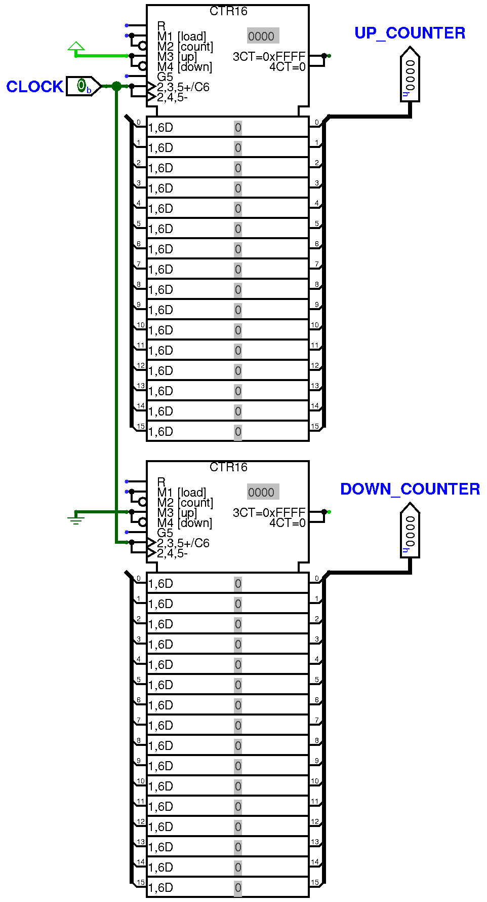

# rust-ASM-compiler

This rust program converted custom assembly instructions to usable machine code
for a custom CPU in Logisim Evolution.

Each component here was developed in a specific lab period over the course of a
semester. Below is a list of components and their function.

This register bank held 32 16-bit values and was capable of reading 8 of them in
one cycle, but for writes the limit was 4 per cycle.

2 Counters, one set to count up, the other down. Each will reset after
overflowing.

These pre-built logical blocks were how we handled math.

These sets of gates performed bitwise logic on 2 inputs.

These 2 components were eventually simplified into the CORE shown below.

These checks were performed on each core to prevent a race condition from
occurring.

This vector unit holds 8 64-bit values, assembled from shared memory and
represented as 4 16-bit values combined.

This block performs the arithmetic necessary to run a dot product operation on 8
16-bit inputs, with the output being 1 64-bit value.
